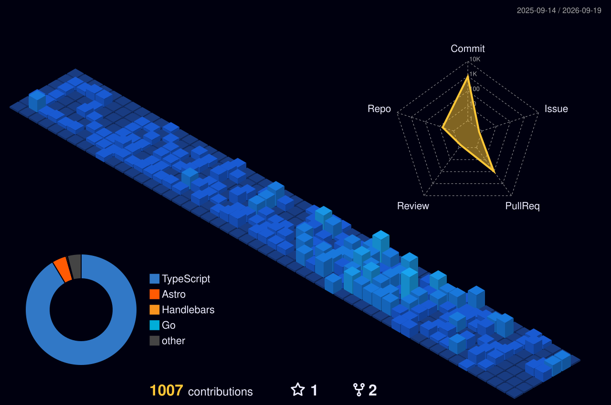

  <!-- Banner Animado Superior -->
  

  <!-- Subtítulo Mecanografiado -->
  

  

    Desarrollador Full Stack con 4 años de experiencia construyendo aplicaciones web y móviles de alto rendimiento[cite: 1]. Especializado en arquitecturas de microservicios, monolitos y gestión autónoma de infraestructura en la nube[cite: 1].
  

  <!-- Enlaces de contacto -->
  

    
    
    
  

---

## 🚀 Sobre Mí

- 👨‍💻 **Experiencia:** 4 años en desarrollo web y móvil end-to-end con Next.js, NestJS y Expo[cite: 1].
- ☁️ **DevOps & Cloud:** Gestión autónoma de infraestructura en AWS, Cloudflare, Contabo y Dokploy[cite: 1].
- 🎓 **Educación:** Ingeniería en Desarrollo y Gestión de Software por la UTRM (2020 - 2024)[cite: 1].

---

## 🛠️ Tech Stack

### Frontend & Mobile

  

 

### Backend & APIs

  

 

### Cloud, DevOps & Herramientas

  

---

## 💻 Proyectos & Experiencia Destacada

<table>
  <tr>
    <td width="50%" valign="top">
      <h3 align="center">📰 Semanario Playa News</h3>
      

        Arquitectura completa de portal informativo digital[cite: 1]. Panel de administración dinámico y CDN/WAF en Cloudflare[cite: 1].
      

      

        <code>Next.js</code> · <code>TypeScript</code> · <code>Cloudflare R2/WAF</code>
      

    </td>
    <td width="50%" valign="top">
      <h3 align="center">📱 Apps Móviles ILogs & Elevadores</h3>
      

        Desarrollo y publicación en App Store y Google Play[cite: 1]. Transición modular a microservicios en NestJS[cite: 1].
      

      

        <code>Expo (React Native)</code> · <code>NestJS</code> · <code>AWS EC2/S3/RDS</code>
      

    </td>
  </tr>
  <tr>
    <td width="50%" valign="top">
      <h3 align="center">🏢 Plataforma Inmobiliaria Luums</h3>
      

        Componentes interactivos de UI y optimización de transferencia de datos con GraphQL[cite: 1].
      

      

        <code>React</code> · <code>GraphQL</code> · <code>NestJS</code>
      

    </td>
    <td width="50%" valign="top">
      <h3 align="center">🌾 Sistema Offline-First</h3>
      

        Sistema web/móvil con SQLite para recolección en campo sin señal y sincronización automática[cite: 1].
      

      

        <code>SQLite</code> · <code>Offline-First</code> · <code>React Native</code>
      

    </td>
  </tr>
</table>

---

## 🎮 Matriz 3D (Commits Públicos y Privados)

  

---

## 📈 Actividad y Tendencias de Commits

  

---

## 🐍 Animación de Contribuciones

  

---

## 📊 Estadísticas Generales y Lenguajes

  <!-- Incluye repositorios públicos y privados en las métricas totales -->
  
  

 

  

---

  Diseñado y mantenido por <a href="https://blarcloud.com">Brayan Leonardo Alvarez Reyes</a>[cite: 1]

